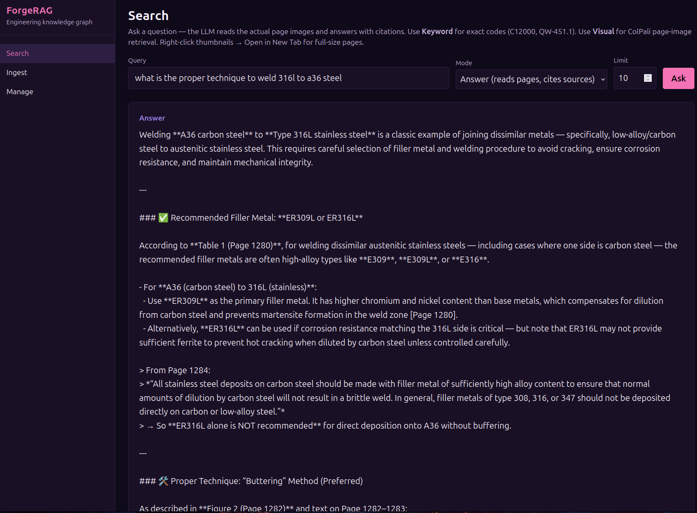
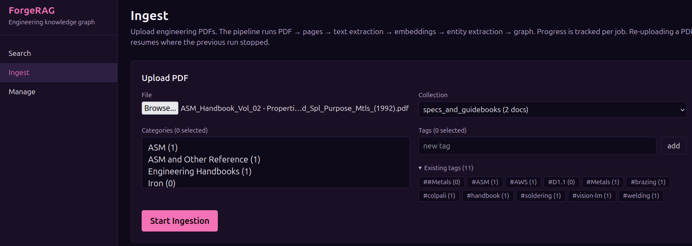
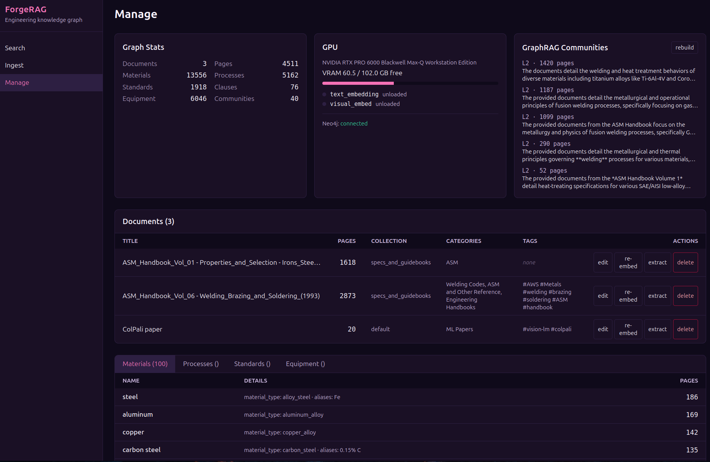

# ForgeRAG

Local engineering knowledge graph for processing and querying large corpora of engineering PDFs. Combines visual document retrieval (Nemotron ColEmbed / ColPali), a Neo4j knowledge graph, and vision-language model answer generation into a single system that can read engineering handbooks, extract entities and relationships, and answer technical questions with page-level citations.

Designed for personal/research use. Runs entirely on local hardware — no cloud APIs.

## Screenshots







## What it does

Ask a question like *"What is alloy C12000 used for and how do I weld it?"* and ForgeRAG will:

1. **Find the right pages** across all your engineering handbooks (keyword + visual retrieval)
2. **Traverse the knowledge graph** to discover related materials, processes, and standards you didn't ask about
3. **Read the actual page images** using a vision LLM (not mangled OCR text)
4. **Synthesize an answer** with `[Page N]` citations linking to a built-in page viewer
5. **Include adjacent pages** automatically so tables spanning page boundaries aren't missed

## Status

Phases 1–9 complete.

- [x] **Phase 1**: FastAPI service + Neo4j schema
- [x] **Phase 2**: PDF ingestion (rasterize → text extract → resume-friendly)
- [x] **Phase 3**: Visual embeddings (Nemotron ColEmbed 4B, hierarchical token pooling)
      + text embeddings (BGE-M3 1024d; Nomic still supported)
- [x] **Phase 4**: LLM entity extraction (Qwen3.5 35B) + knowledge graph queries
- [x] **Phase 5**: GraphRAG communities, hybrid search, page highlighting
- [x] **Phase 6**: React/Vite frontend (Search, Ingest, Manage, Page Viewer)
- [x] **Phase 7**: Choom agent skill integration (5 tools)
- [x] **Phase 8**: Auto-tagging, entity canonicalization, bulk re-embed
- [x] **Phase 9**: Structural chunking (Docling) + per-chunk LLM summaries
      + RRF hybrid (BM25 + dense) + BGE reranker + Formula/Table/topic-tag
      extraction + Standards `title` field + data-quality validators

## Architecture

```
┌──────────────────────────────────────────────────────┐
│              React/Vite GUI (:8200/app/)              │
│  Search (Answer/Keyword/Visual) · Ingest · Manage    │
├──────────────────────────────────────────────────────┤
│              FastAPI REST API (:8200)                  │
│  29 endpoints · ForgeResult{success, reason, data}    │
├───────────┬──────────────┬───────────────────────────┤
│  Neo4j    │  Nemotron    │  Page Image Store         │
│  Graph +  │  ColEmbed 4B │  (PNGs + reduced JPGs,    │
│  Vector   │  + MaxSim    │   page viewer with nav)   │
│  + Lucene │  reranking   │                           │
└───────────┴──────────────┴───────────────────────────┘
```

**Hardware** (designed for this specific setup):
- **NUC i7, 96 GB DDR5** — Neo4j, FastAPI, frontend, page images
- **NVIDIA RTX PRO 6000 Blackwell, 96 GB VRAM** — Nemotron ColEmbed, text embeddings, Qwen3.5 VLM
- **M3 Ultra Mac, 256 GB RAM** — LM Studio for auxiliary LLMs (optional)

## Knowledge Graph

Documents are organized into domain-specific **collections** (e.g., `asm_references`, `mechanical_design`, `firearms`). Each document's pages are further split into **structural chunks** (paragraphs, tables, figures, equations) via Docling, with per-chunk LLM summaries and BGE-M3 embeddings. Entities extracted from page text populate the knowledge graph; chunks carry the retrieval embeddings.

```
(:Document)─[:HAS_PAGE]─►(:Page)─[:HAS_CHUNK]─►(:Chunk)
     │                      │                      └─ text + summary + embedding
     ├─[:IN_CATEGORY]─►(:Category)                    chunk_type (text/table/figure/…)
     ├─[:TAGGED_WITH]─►(:Tag)                         section_path + bbox
     │
     │                      ├─[:MENTIONS_MATERIAL]─►(:Material)
     │                      ├─[:DESCRIBES_PROCESS]─►(:Process)
     │                      ├─[:REFERENCES_STANDARD]─►(:Standard)
     │                      ├─[:MENTIONS_EQUIPMENT]─►(:Equipment)
     │                      ├─[:MENTIONS_FORMULA]──►(:Formula)
     │                      └─[:MENTIONS_TABLE]────►(:RefTable)
     │
     └─ Page.topic_tags: ["tap-drill-chart", "fastener-torque", …]

(:Material)─[:GOVERNED_BY]─►(:Standard)
(:Material)─[:COMPATIBLE_WITH_PROCESS]─►(:Process)
(:Standard)─[:REFERENCES]─►(:Standard)
(:Standard)─[:CONTAINS_CLAUSE]─►(:Clause)
(:Page)─[:IN_COMMUNITY]─►(:Community)  ← GraphRAG summaries
```

**Node types added in Phase 9:**
- `Chunk` — paragraph/table/figure-level unit with BGE-M3 embedding + LLM summary. Primary retrieval target (replaces whole-page text as the search granularity).
- `Formula` — named engineering formulas (`kind`: stress, deflection, torque, power, electrical…) with expression + variable definitions.
- `RefTable` — design-handbook reference tables (`kind`: dimensions, specifications, conversion, selection…) with title + natural-language description.
- `Page.topic_tags` — page-level kebab-case topic classifier (`tap-drill-chart`, `conductor-ampacity`, `gear-tooth-geometry`, …) as a fast retrieval filter.

**Entity canonicalization** (Phase 8): Material / Equipment / Process / Standard nodes go through Tier 1 case-fold + singularization + designation-prefix merging at apply time. Existing graphs can be canonicalized retroactively via the scripts below.

**Standard codes vs titles**: `Standard.code` is the short designator (`ASME BPVC IX`, `NFPA 70`, `SEMI S2`); `Standard.title` is the full descriptive title. Both are alias-aware in queries.

## Search Modes

| Mode | What it does | Best for |
|------|-------------|----------|
| **Answer** (default) | RRF hybrid + BGE reranker + graph traversal → VLM reads page images → synthesized answer with citations | Questions: *"What preheat does ASME IX require for P-1 over 1 inch?"* |
| **Keyword** | Lucene full-text phrase search on extracted text/chunks | Specific codes: *"C12000"*, *"QW-451.1"*, *"ASTM A 709"* |
| **Visual** | ColPali/Nemotron two-stage retrieval (text-vector coarse → MaxSim rerank) | Finding specific charts, tables, diagrams |
| **Hybrid** | Strategies: `rrf` (BM25 + dense + bge-reranker, default), `graph_boosted`, `vector_first`, `graph_first`, `community` | Tuned search behaviour per query type |

### RRF Hybrid (default)

`rrf` fuses two independent rankings with Reciprocal Rank Fusion (k=60):

1. **BM25** over chunk text + summary via Neo4j's Lucene full-text index — catches rare exact tokens (`QW-451.1`, `6061-T6`, `ER308LT-1`) that dense embeddings blur.
2. **Dense vector** similarity over BGE-M3 1024-dim chunk embeddings — catches semantic paraphrases.

The top ~50 fused candidates are then reranked by **`BAAI/bge-reranker-v2-m3`**, a cross-encoder that scores each (query, chunk) pair in one pass. Final top-K is returned to the caller. `rerank: false` on the request skips the cross-encoder if you want to inspect raw RRF order.

Answer mode includes **adjacent pages** (N-1 and N+1) so the VLM can read tables that span page boundaries. It also feeds **knowledge graph context** (relationship chains, related entities, community summaries) into the LLM prompt so it can mention relevant standards and processes the user didn't specifically ask about.

## Retrieval Models

**Text embeddings** — BGE-M3 (1024-dim) is the Phase 9 default; the older Nomic v1.5 (768-dim) is still supported by toggling `text_embedding_model`. Query-time prefix handling is model-aware (Nomic uses `search_query: ` / `search_document: `; BGE-M3 doesn't).

**Reranker** — `BAAI/bge-reranker-v2-m3` cross-encoder (~1.2 GB VRAM, fp16). Lazy-loaded, auto-unloaded when idle. Re-scores top-K hybrid candidates.

**Visual embeddings:**

| Model | Embed dim | Native tokens/page | With pool_factor=3 | VRAM | Storage/page |
|-------|-----------|-------------------|-------------------|------|-------------|
| **Nemotron ColEmbed 4B** (default) | 128 (projected from 2560) | 773 | ~258 | ~12 GB | ~130 KB pooled |
| ColPali v1.3 (fallback) | 128 | 1031 | ~343 | ~24 GB | ~175 KB pooled |

Both visual models share a single `visual_pool_factor_storage` config knob (default 3) that applies `HierarchicalTokenPooler` at embed time — semantic clusters of patches (whitespace, uniform text, figure regions) collapse to one representative vector each. 3x reduction in storage and MaxSim compute with negligible accuracy loss. Set to 1 to disable.

Configured via `visual_model_type` in `config/forgerag.toml`. Both use MaxSim late-interaction scoring and the same binary blob storage format on Page nodes.

## Setup

### Prerequisites

- Python 3.12+, Node.js 24+
- Neo4j Community Edition 5.x
- NVIDIA GPU with CUDA 12.8+ (for Nemotron/ColPali embeddings)
- LM Studio or llama.cpp server (for entity extraction + answer generation)

### Install

```bash
# 1. Clone and set up Python
cd /home/nuc1/projects/ForgeRAG
python3 -m venv venv
./venv/bin/pip install -r requirements.txt

# 2. Install Neo4j (one-time)
./scripts/install_neo4j.sh
# Change password:
cypher-shell -u neo4j -p neo4j -d system \
    "ALTER CURRENT USER SET PASSWORD FROM 'neo4j' TO 'YOUR_PASSWORD'"

# 3. Set up secrets
sudo mkdir -p /etc/forgerag
echo "NEO4J_PASSWORD='YOUR_PASSWORD'" | sudo tee /etc/forgerag/env > /dev/null
sudo chmod 600 /etc/forgerag/env

# 4. Copy and edit config
cp config/forgerag.toml.example config/forgerag.toml

# 5. Seed Neo4j schema
export NEO4J_PASSWORD='YOUR_PASSWORD'
./venv/bin/python scripts/seed_schema.py

# 6. Build frontend
cd frontend && npm install && npm run build && cd ..

# 7. Install systemd service
sudo cp systemd/forgerag-api.service /etc/systemd/system/
sudo systemctl daemon-reload
sudo systemctl enable forgerag-api
sudo systemctl start forgerag-api
```

### Verify

```bash
curl -s http://localhost:8200/health | python3 -m json.tool
# Expect: neo4j_connected: true, gpu_available: true
```

Web GUI: `http://localhost:8200/app/`

## Usage

### Ingest a PDF

1. Open `http://localhost:8200/app/` → **Ingest** tab
2. Select a PDF, choose a collection (or create a new one), add tags
3. Click **Start Ingestion** — pipeline runs automatically:
   - PDF → page images (300 DPI PNGs + reduced JPGs)
   - Text extraction (PyMuPDF, scanned detection)
   - Text embeddings (nomic-embed-text-v1.5, 768d)
   - Visual embeddings (Nemotron ColEmbed 4B, 128d projected)
   - Entity extraction (Qwen3.5 35B via LM Studio)
4. Monitor progress on the Ingest tab

### Search

- **Answer mode** (default): type a question, get a synthesized answer with page citations
- **Keyword**: exact match for alloy codes, clause IDs, standard numbers
- Click page thumbnails to expand. Use Prev/Next to browse adjacent pages.
- Source links open in the Page Viewer (dedicated full-page view with navigation)

### Manage

- **Documents table**: edit collection, tags, categories inline. Per-row actions: rebuild chunks (Phase 9), extract-only (retry failed pages), re-embed (legacy), extract entities (legacy), delete.
- **Multi-select + bulk actions**: checkboxes on each row. Select multiple documents, then "rebuild (N)", "extract-only", or "only-missing" (skip docs that already have chunks). Jobs queue sequentially — pick a handful to run now or queue the whole library overnight.
- **Graph Stats**: live entity counts across the knowledge graph
- **GPU**: VRAM usage, loaded models, manual unload
- **Communities**: rebuild GraphRAG summaries from the entity graph
- **Entities**: browse Materials, Processes, Standards, Equipment with page mention counts

### Rebuild existing documents for Phase 9

Documents ingested before Phase 9 only have Page-level embeddings. To get them onto the new chunked + RRF retrieval path:

**GUI path** — Manage tab, select docs, click "rebuild". Progress in the Ingest tab.

**CLI path**:

```bash
# Full rebuild of every doc — runs overnight at scale
NEO4J_PASSWORD=... ./venv/bin/python scripts/rebuild_chunks.py

# Just the docs that don't have chunks yet (resume)
NEO4J_PASSWORD=... ./venv/bin/python scripts/rebuild_chunks.py --only-missing

# One specific doc
NEO4J_PASSWORD=... ./venv/bin/python scripts/rebuild_chunks.py --doc-id DOC_XXX

# Cheap retry: only re-extract entities on pages that failed
NEO4J_PASSWORD=... ./venv/bin/python scripts/rebuild_chunks.py --doc-id DOC_XXX --extract-only
```

Flags:
- `--only-missing` — skip docs that already have Chunk nodes
- `--skip-extract` — chunks + summaries + embeddings only (no entity re-extraction)
- `--extract-only` — only re-extract entities on pages missing `topic_tags` (inverse of `--skip-extract`)

## API Endpoints

### Core
| Method | Path | Description |
|--------|------|-------------|
| GET | `/health` | Service status, Neo4j, GPU, counts |
| GET | `/collections` | List collections with doc/page counts |

### Search
| Method | Path | Description |
|--------|------|-------------|
| POST | `/search/answer` | RAG answer (keyword+visual+graph → VLM reads pages) |
| POST | `/search/keyword` | Lucene full-text phrase search |
| POST | `/search/visual` | ColPali/Nemotron two-stage visual retrieval |
| POST | `/search/semantic` | Text embedding vector search |
| POST | `/search/hybrid` | Vector + graph-boosted / graph-first / community |

### Documents
| Method | Path | Description |
|--------|------|-------------|
| GET | `/documents` | List (filter by collection/category/tag) |
| GET | `/documents/{id}` | Detail |
| DELETE | `/documents/{id}` | Delete (cascade: pages, images, entities) |
| PUT | `/documents/{id}/collection` | Move to a different collection |
| POST | `/documents/{id}/tags` | Add a tag |
| DELETE | `/documents/{id}/tags/{name}` | Remove a tag |
| POST | `/documents/{id}/categories` | Add a category |
| DELETE | `/documents/{id}/categories/{name}` | Remove a category |
| POST | `/documents/{id}/reembed` | Re-run visual + text embeddings |
| POST | `/documents/{id}/extract-entities` | Re-run LLM entity extraction |
| POST | `/documents/{id}/rebuild-chunks` | Phase 9 rebuild: chunks + summaries + embeddings + entity re-extraction. Query params: `extract_only=true` (only re-extract pages missing topic_tags), `skip_extract=true` (chunks only) |
| GET | `/documents/{id}/pages` | List pages |
| GET | `/documents/{id}/pages/{n}` | Page detail with full text |

### Ingestion
| Method | Path | Description |
|--------|------|-------------|
| POST | `/ingest` | Upload PDF (multipart: file, collection, categories, tags) |
| GET | `/ingest/jobs/{id}` | Poll job progress |
| GET | `/ingest/jobs` | List recent jobs |

### Knowledge Graph
| Method | Path | Description |
|--------|------|-------------|
| POST | `/graph/query` | Predefined graph queries (material_standards, process_materials, etc.) |
| POST | `/graph/explore` | N-hop neighborhood of an entity |
| GET | `/graph/entities/{type}` | List extracted entities with mention counts |
| GET | `/graph/stats` | Per-label node counts |
| POST | `/graph/build-communities` | Rebuild GraphRAG community summaries |
| GET | `/graph/communities` | List communities |

### Images
| Method | Path | Description |
|--------|------|-------------|
| GET | `/images/{hash}/{page}` | Full-resolution PNG |
| GET | `/images/{hash}/{page}/reduced` | Reduced JPG thumbnail |

### System
| Method | Path | Description |
|--------|------|-------------|
| GET | `/system/gpu` | VRAM usage + loaded models |
| POST | `/system/models/{name}/unload` | Manually unload a model |

### Admin
| Method | Path | Description |
|--------|------|-------------|
| POST | `/admin/normalize-entities` | Merge duplicate entities that differ only by case/whitespace |
| POST | `/admin/bulk-reembed` | Queue re-embed jobs for every document |
| POST | `/admin/rebuild-chunks-bulk` | Queue Phase 9 chunk rebuilds for a list of doc_ids. Body: `{doc_ids, extract_only?, skip_extract?, only_missing?}`. Jobs run sequentially |
| POST | `/admin/cleanup-uploads` | Delete staged upload files |

## Configuration

See `config/forgerag.toml.example` for all settings. Key sections:

| Section | Key settings |
|---------|-------------|
| `[server]` | port (8200), data_dir |
| `[neo4j]` | uri, database (neo4j), password_env |
| `[models]` | `visual_model_name`, `visual_model_type` (nemotron/colpali), `visual_embed_dim` (128), `colpali_pool_factor_storage` (3, shared by both visual models), `text_embedding_model` (`BAAI/bge-m3` default), `text_embedding_dim` (1024), `reranker_model` (`BAAI/bge-reranker-v2-m3`) |
| `[llm]` | endpoint (LM Studio), model (qwen3.5-35b-a3b), use_json_schema, max_tokens (4096; entity extraction internally bumps to 8192 for standards-heavy pages) |
| `[ingestion]` | pdf_dpi (300), batch sizes, scanned text threshold |
| `[gpu]` | device, model_idle_unload_seconds (300) |

## Project Structure

```
ForgeRAG/
├── backend/
│   ├── main.py                    FastAPI app, lifespan, router wiring
│   ├── config.py                  Pydantic Settings from TOML
│   ├── run.py                     Uvicorn entrypoint (loads /etc/forgerag/env)
│   ├── models/                    Pydantic request/response models
│   ├── routers/                   API route handlers
│   │   ├── search.py              Answer, keyword, visual, semantic, hybrid search
│   │   ├── documents.py           Document/collection/tag/category CRUD
│   │   ├── ingestion.py           PDF upload + job tracking
│   │   ├── graph.py               Knowledge graph queries + communities
│   │   ├── images.py              Page image serving + viewer
│   │   ├── system.py              GPU status + model management
│   │   └── admin.py               Dedup, cleanup utilities
│   ├── services/
│   │   ├── nemotron_service.py    Nemotron ColEmbed 4B + hierarchical token pooling
│   │   ├── colpali_service.py     ColPali v1.3 (legacy visual retrieval)
│   │   ├── text_embedding_service.py  BGE-M3 / Nomic (model-aware prefixes)
│   │   ├── reranker_service.py    bge-reranker-v2-m3 cross-encoder
│   │   ├── llm_service.py         OpenAI-compatible LLM client (response preview
│   │   │                           logging on validation failure)
│   │   ├── gpu_manager.py         VRAM tracking, semaphore, idle unload
│   │   ├── graph_reasoning.py     Graph traversal for answer context
│   │   ├── image_service.py       Page highlight overlay (ColPali heatmap)
│   │   └── neo4j_service.py       Async Neo4j driver wrapper
│   ├── ingestion/
│   │   ├── pipeline.py            Ingestion orchestrator (full + partial runs)
│   │   ├── pdf_processor.py       PDF → PNGs (chunked, resume-friendly)
│   │   ├── text_extractor.py      PyMuPDF text extraction
│   │   ├── chunker.py             Docling structural chunker (para/table/fig/eq)
│   │   ├── chunk_summarizer.py    Per-chunk LLM summaries (short chunks bypass LLM)
│   │   ├── entity_extractor.py    LLM structured entity/relationship extraction
│   │   │                           with content validators (prompt-leak, JSON-debris,
│   │   │                           prose-as-name, bibliographic-reference filters)
│   │   ├── graph_builder.py       Neo4j MERGE for entities + relationships + chunks
│   │   ├── community_detector.py  Leiden clustering + LLM summaries
│   │   └── job_manager.py         SQLite job queue
│   └── db/
│       └── neo4j_schema.py        Constraints, indexes, vector indexes, full-text
├── frontend/
│   ├── src/
│   │   ├── pages/
│   │   │   ├── Search.tsx         Answer/Keyword/Visual/Hybrid search
│   │   │   ├── Ingest.tsx         Upload form + job progress
│   │   │   ├── Manage.tsx         Documents, entities, GPU, communities
│   │   │   └── Viewer.tsx         Full-page viewer with navigation
│   │   ├── components/Layout.tsx  Sidebar nav with live health indicators
│   │   └── api/                   Typed client + types
│   └── vite.config.ts             Proxy + /app/ base path
├── config/forgerag.toml           Active config (gitignored)
├── config/forgerag.toml.example   Template
├── systemd/forgerag-api.service   systemd unit
├── scripts/
│   ├── install_neo4j.sh                  Neo4j Community 5.x installer
│   ├── seed_schema.py                    Apply Neo4j schema (idempotent)
│   ├── rebuild_chunks.py                 Phase 9 CLI rebuild: chunks + summaries
│   │                                      + BGE-M3 embeddings + entity re-extraction.
│   │                                      Flags: --doc-id, --only-missing, --skip-extract,
│   │                                      --extract-only
│   ├── canonicalize_materials_dryrun.py  Plan Tier 1 Material canonicalization
│   ├── canonicalize_materials_apply.py   Apply the plan (idempotent, per-group tx)
│   ├── canonicalize_entity_dryrun.py     Generalized canonicalization for any label
│   ├── canonicalize_entity_apply.py      (--label Equipment|Process|Standard|Material)
│   └── cleanup_numeric_garbage.py        Null LLM-debris values in Material numeric fields
└── data/                          Runtime data (gitignored)
    ├── page_images/{hash}/        Full-resolution PNGs
    ├── reduced_images/{hash}/     Reduced JPGs
    ├── uploads/                   Staged PDFs (cleaned via admin endpoint)
    └── jobs.sqlite                Ingestion job queue
```

## LLM Model Notes

**Entity extraction** (Qwen3.5 35B MoE, 3B active):
- Requires `use_json_schema = true` and `/no_think` in the prompt
- Runs on RTX 6000 via LM Studio at ~135 tok/s, ~8-10s per page
- LM Studio "thinking" toggle should be OFF

**Gemma 4 26B MoE**: breaks under strict JSON schema grammar (degenerate repetition). Use `use_json_schema = false`.

**GLM 4.7 Flash**: reasoning model, too slow for batch extraction (~25 tok/s). Outputs to `reasoning_content` field — the LLM client handles this via fallback.

## License

Code: MIT. Models have their own licenses:
- Nemotron ColEmbed: CC-BY-NC-4.0 (non-commercial)
- ColPali v1.3: MIT
- BGE-M3 / bge-reranker-v2-m3: MIT
- nomic-embed-text: Apache 2.0
- Docling + docling-models: MIT / Apache 2.0
