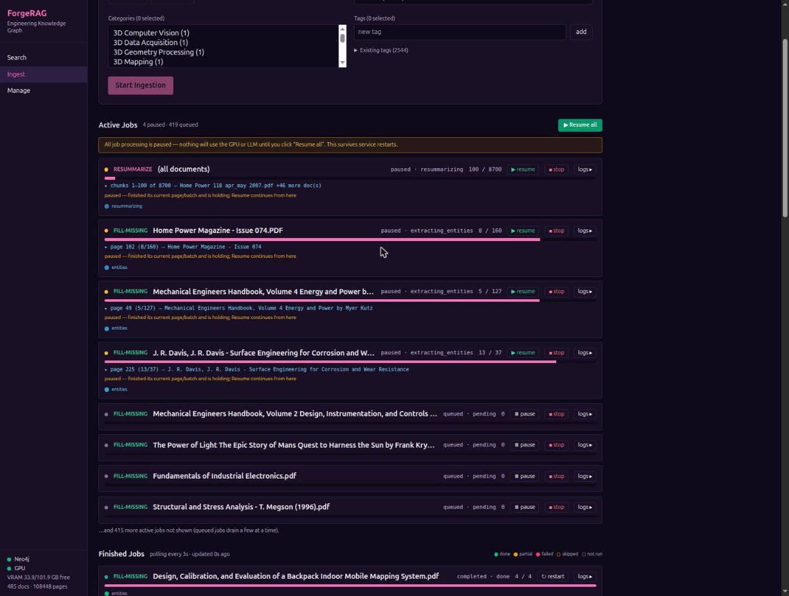
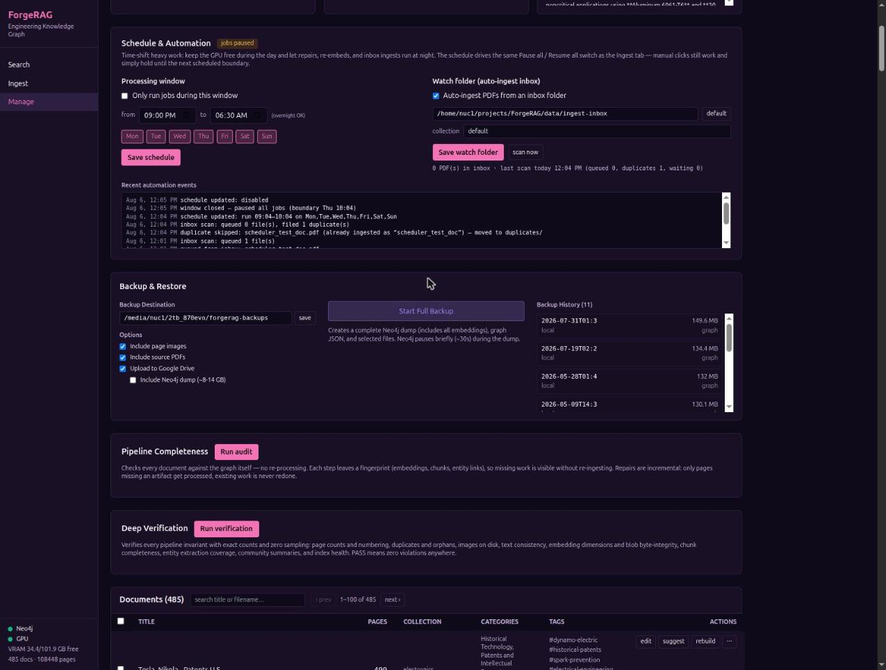
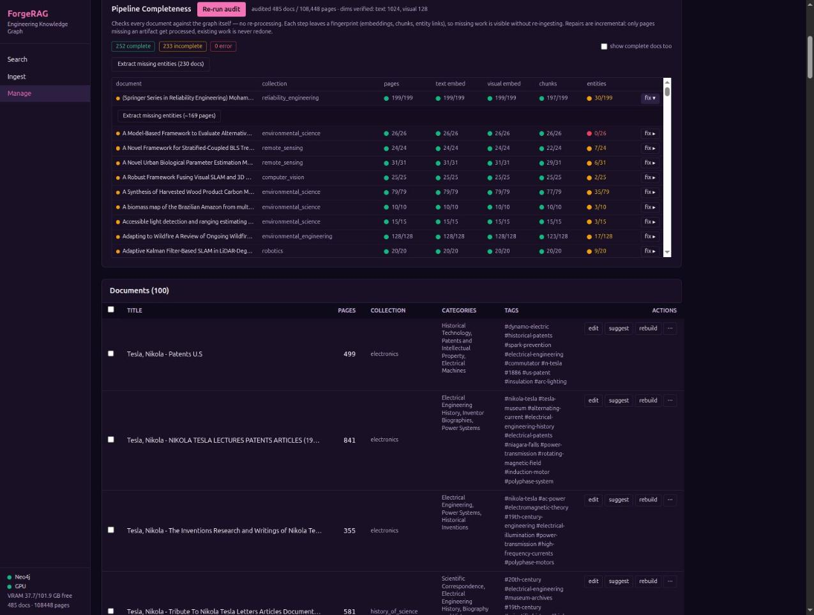

# ForgeRAG

Local engineering knowledge graph for processing and querying large corpora of engineering PDFs. Combines visual document retrieval (Nemotron ColEmbed / ColPali), a Neo4j knowledge graph, and vision-language model answer generation into a single system that can read engineering handbooks, extract entities and relationships, and answer technical questions with page-level citations.

Designed for personal/research use. Runs entirely on local hardware — no cloud APIs.

**Paper:** the design, its lineage, and an audited evaluation are written up in
[*ForgeRAG: A Verifiable, Local-First, Multi-Plane Retrieval System for Engineering Reference Libraries*](docs/paper/forgerag-paper.pdf) (PDF, 7 pages).

## Screenshots









## What it does

Ask a question like *"What is alloy C12000 used for and how do I weld it?"* and ForgeRAG will:

1. **Find the right pages** across all your engineering handbooks (keyword + visual retrieval)
2. **Traverse the knowledge graph** to discover related materials, processes, and standards you didn't ask about
3. **Read the actual page images** using a vision LLM (not mangled OCR text)
4. **Synthesize an answer** with `[Page N]` citations linking to a built-in page viewer
5. **Include adjacent pages** automatically so tables spanning page boundaries aren't missed

## Status

All phases complete.

- [x] **Phase 1**: FastAPI service + Neo4j schema
- [x] **Phase 2**: PDF ingestion (rasterize, text extract, resume-friendly)
- [x] **Phase 3**: Visual embeddings (Nemotron ColEmbed 4B, hierarchical token pooling)
      + text embeddings (BGE-M3 1024d)
- [x] **Phase 4**: LLM entity extraction (Qwen 3.6 35B-A3B) + knowledge graph queries
- [x] **Phase 5**: GraphRAG communities, hybrid search, page highlighting
- [x] **Phase 6**: React/Vite frontend (Search, Ingest, Manage, Page Viewer)
- [x] **Phase 7**: Choom agent skill integration (manifest, auto-search, batch)
- [x] **Phase 8**: Auto-tagging, entity canonicalization, bulk re-embed
- [x] **Phase 9**: Structural chunking (Docling) + per-chunk LLM summaries
      + RRF hybrid (BM25 + dense) + BGE reranker + Formula/Table/topic-tag
      extraction + Standards `title` field + data-quality validators
- [x] **Phase 10**: Backup & Restore system (Neo4j dump, image copy, Google Drive upload)
- [x] **Phase 11**: Pipeline observability — per-job step ledger with status circles,
      per-job log capture + viewer, completeness audit across the whole library,
      and incremental gap-filling repairs (bulk and per-document)
- [x] **Phase 12**: Job control — Active Jobs panel with live "now working on"
      labels, per-job pause/resume/stop/restart, and a persistent "Pause all
      (free GPU)" switch for time-shifting heavy repair work
- [x] **Phase 13**: Schedule & Automation — daily processing window that
      drives the pause/resume switch automatically, plus a watch-folder
      inbox that auto-ingests dropped PDFs when processing is allowed

## New Features

Recent additions since the Phase 9 baseline:

- **Search error boundary** — no more blank pages when switching between search modes. The React search view catches rendering errors and recovers gracefully.
- **Fuzzy entity matching** — EntityMatcher service loads entity names from Neo4j into memory and matches query text with difflib SequenceMatcher. Handles OCR-style typos, missing special characters, case mismatches, and spacing differences. Noise-word filtering, a 25-window cap, and a 5-second time budget prevent long natural-language queries from hanging (previously ~200s on 180K+ entities).
- **OCR typo tolerance** — keyword search now uses Lucene `~1` fuzzy operator so queries like "alumnum" still match "aluminum" in extracted text.
- **Community search weighted by member count** — community results are ranked by the number of entity members, surfacing the most connected communities first.
- **LLM circuit breaker** — 5 consecutive LLM failures trip the breaker open; all requests fail fast for 60 seconds, then a single probe request is allowed through. Prevents cascading timeouts during LM Studio restarts.
- **Neo4j health loop** — 30-second heartbeat with exponential backoff auto-reconnect. The service stays alive and recovers automatically when Neo4j restarts for a dump or update.
- **Choom skills integration** — `/skills/manifest` advertises ForgeRAG capabilities with live stats; `/skills/search` auto-routes queries (keyword vs answer vs hybrid) based on content; `/skills/batch` runs up to 20 queries in parallel.
- **Backup & Restore system** — GUI-driven and CLI-driven full backups with Neo4j dump, graph JSON export, page images, reduced images, source PDFs, and optional Google Drive upload. Incremental: subsequent backups skip unchanged files.
- **Per-job step ledger** — every job (ingest, re-embed, extract, rebuild-chunks, fill-missing, communities) records a per-step status ledger shown as colored circles on the job card: green done, amber partial/skipped (with the reason), red failed, hollow not run, pulsing running. Steps that used to be skipped silently (LLM down, service not wired) are now visibly marked.
- **Per-job log viewer** — a "logs" button on each job card shows every backend log line captured while that job ran (including worker threads: Docling, rasterizer, model loading). Logs live-tail running jobs, persist in SQLite, and survive service restarts for post-mortems.
- **Pipeline Completeness audit** — one click on the Manage page audits every document against the graph itself (no re-processing): page counts, text/visual embedding coverage with dimension verification, chunk coverage, and entity coverage. A ~100k-page library audits in seconds.
- **Incremental gap repair** — fill-missing jobs process *only* pages lacking an artifact, never redoing finished work. Bulk buttons repair every affected doc at once; each problem row also has a per-document "fix" panel offering exactly the repairs that apply (fill embeddings, extract missing entities, build/rebuild chunks, or full re-embed for wrong-dimension vectors).
- **OCR text recovery for scanned PDFs** — scanned documents have no text layer, so page-level extraction finds nothing; but Docling OCRs the page images during chunking, so the real text lives on the Chunk nodes. The audit flags these ("page text" column), and a one-click repair copies the OCR text back onto the pages, then embeds it and extracts entities from it — turning image-only books into fully searchable ones.
- **Deep Verification** — a Manage-page card (and `GET /admin/verify`) that proves the database is intact with exact counts and zero sampling: page counts and numbering, duplicates and orphans, every page image on disk, text consistency, embedding presence at exact dimensions, visual-embedding blob byte-integrity, chunk completeness, extraction coverage, and index health. The verdict is PASS only at literally zero violations.
- **Job control (pause / stop / restart)** — every background job is a tracked task. The Ingest tab's **Active Jobs** panel shows what each job is working on *right now* ("page 267 (4/368) — ASM Handbook Vol 3"), with per-job pause/resume/stop buttons and a restart button on finished jobs. Pause and stop are cooperative — the current page/batch finishes first, so nothing is half-written — and every repair recomputes its missing-work set, so a stopped job restarted later continues instead of redoing. **Pause all (free GPU)** holds the entire queue (persists across service restarts; jobs launched while paused hold immediately), letting you keep the GPU free during the day and run repairs overnight with one click.
- **Schedule & Automation** — a Manage-page card that automates the pause/resume switch on a daily **processing window** ("run jobs 21:00 → 06:30 on these days", overnight windows supported). The scheduler fires at window boundaries, catches up after a reboot, and leaves manual pause/resume clicks in force until the next boundary. The same card configures a **watch folder**: PDFs dropped into an inbox (subfolders included) are auto-ingested through the normal pipeline (same concurrency caps) whenever processing is allowed — with a schedule on, files dropped during the day simply wait for the window. Files are picked up only once fully copied, hash-checked so already-ingested PDFs are filed to `duplicates/` without spending any GPU, and moved to `ingested/` when queued (folder structure preserved). A built-in folder browser picks the inbox path; an **open** button pops it up in the file manager. A live event log shows everything the scheduler has done.

## Architecture

```
+------------------------------------------------------+
|              React/Vite GUI (:8200/app/)              |
|  Search (Answer/Keyword/Visual) . Ingest . Manage    |
+------------------------------------------------------+
|              FastAPI REST API (:8200)                  |
|  40+ endpoints . ForgeResult{success, reason, data}   |
+-------------+--------------+-------------------------+
|  Neo4j      |  Nemotron    |  Page Image Store        |
|  Graph +    |  ColEmbed 4B |  (PNGs + reduced JPGs,   |
|  Vector     |  + MaxSim    |   page viewer with nav)  |
|  + Lucene   |  reranking   |                          |
+-------------+--------------+-------------------------+
```

## Models & Hardware

### Models

| Model | Role | Why this model |
|-------|------|----------------|
| **BGE-M3** (1024d) | Text embedding | Multilingual, strong retrieval benchmarks on technical content, no query/doc prefix needed (unlike Nomic which requires `search_query:` / `search_document:` prefixes). Pairs naturally with bge-reranker-v2-m3 |
| **Nemotron ColEmbed VL-4B-v2** (128d projected) | Visual embedding | Best-in-class visual document retrieval. Projects from 2560d to 128d with 96.8% accuracy retention. Hierarchical token pooling (pool_factor=3) reduces storage 3x with negligible accuracy loss |
| **BGE Reranker v2-m3** | Cross-encoder reranker | Re-scores top-K candidates from hybrid retrieval. Significant accuracy improvement over raw vector cosine scores, especially for technical queries with rare tokens |
| **Qwen 3.6 35B-A3B** | Entity extraction LLM | MoE architecture (only 3B active parameters), fast JSON extraction via json_schema grammar, ~135 tok/s on RTX 6000 via LM Studio. Changed from Qwen 3.5 — 3.6 requires `chat_template_kwargs.enable_thinking=False` instead of the old `/no_think` directive (see LLM Model Notes) |
| **ColPali v1.3** (128d) | Visual embedding (legacy fallback) | Still supported via `visual_model_type = "colpali"` in config. Nemotron is default due to ~20-30% better accuracy on tables/charts |

### Minimum Hardware

- **GPU**: 24 GB VRAM minimum (Nemotron + text embedding model). 48+ GB recommended for concurrent model loading (visual + text + reranker loaded simultaneously)
- **RAM**: 32 GB minimum, 64 GB recommended (Neo4j heap + Python processes + Node.js frontend build)
- **Storage**: 100 GB minimum for a small corpus. Approximately 1 GB per 100 pages (page images + reduced images + embeddings). Current 83-document corpus uses ~80 GB
- **CPU**: 8+ cores recommended for PDF rasterization (parallel page conversion) and Neo4j query processing

### Recommended Hardware (what ForgeRAG was built on)

- **Intel NUC i7, 96 GB DDR5** — Neo4j, FastAPI, frontend, page images
- **NVIDIA RTX PRO 6000 Blackwell, 96 GB VRAM** — Nemotron ColEmbed, text embeddings, Qwen 3.6 VLM, BGE reranker
- **2 TB NVMe** for data directory (page images, reduced images, Neo4j database)

## Knowledge Graph

Documents are organized into domain-specific **collections** (e.g., `asm_references`, `mechanical_design`, `firearms`). Each document's pages are further split into **structural chunks** (paragraphs, tables, figures, equations) via Docling, with per-chunk LLM summaries and BGE-M3 embeddings. Entities extracted from page text populate the knowledge graph; chunks carry the retrieval embeddings.

```
(:Document)--[:HAS_PAGE]-->(:Page)--[:HAS_CHUNK]-->(:Chunk)
     |                      |                      +- text + summary + embedding
     +--[:IN_CATEGORY]-->(:Category)                  chunk_type (text/table/figure/...)
     +--[:TAGGED_WITH]-->(:Tag)                       section_path + bbox
     |
     |                      +--[:MENTIONS_MATERIAL]-->(:Material)
     |                      +--[:DESCRIBES_PROCESS]-->(:Process)
     |                      +--[:REFERENCES_STANDARD]-->(:Standard)
     |                      +--[:MENTIONS_EQUIPMENT]-->(:Equipment)
     |                      +--[:MENTIONS_FORMULA]-->(:Formula)
     |                      +--[:MENTIONS_TABLE]-->(:RefTable)
     |
     +- Page.topic_tags: ["tap-drill-chart", "fastener-torque", ...]

(:Material)--[:GOVERNED_BY]-->(:Standard)
(:Material)--[:COMPATIBLE_WITH_PROCESS]-->(:Process)
(:Standard)--[:REFERENCES]-->(:Standard)
(:Standard)--[:CONTAINS_CLAUSE]-->(:Clause)
(:Page)--[:IN_COMMUNITY]-->(:Community)  <-- GraphRAG summaries
```

**Node types added in Phase 9:**
- `Chunk` — paragraph/table/figure-level unit with BGE-M3 embedding + LLM summary. Primary retrieval target (replaces whole-page text as the search granularity).
- `Formula` — named engineering formulas (`kind`: stress, deflection, torque, power, electrical...) with expression + variable definitions.
- `RefTable` — design-handbook reference tables (`kind`: dimensions, specifications, conversion, selection...) with title + natural-language description.
- `Page.topic_tags` — page-level kebab-case topic classifier (`tap-drill-chart`, `conductor-ampacity`, `gear-tooth-geometry`, ...) as a fast retrieval filter.

**Entity deduplication** runs at two levels:

- **Tier 1 (canonicalization)**: case-fold + singularization + designation-prefix merging. Handles "Stainless Steel" vs "stainless steel" vs "stainless steels". Run retroactively via `scripts/canonicalize_entity_dryrun.py` + `canonicalize_entity_apply.py`.
- **Tier 2 (fuzzy dedup)**: SequenceMatcher similarity matching with safety guards (blocks different alloy numbers, conflicting properties, well-established entities). Handles "Ti-6Al-4V" vs "Ti6Al4V" vs "TI-6AL-4V", "gas-tungsten arc welding" vs "Gas Tungsten Arc Welding". Run via `scripts/dedup_entities_dryrun.py` + `dedup_entities_apply.py`.
- **Automatic (per-ingestion)**: after each document's entity extraction, a lightweight dedup pass merges near-duplicates created by that document against existing entities. Uses a 0.92 similarity threshold with numeric-designation guards. No manual intervention needed — new documents won't create "Stainless Steel" when "stainless steel" already exists.

Merged entity names are preserved as `common_names` on the surviving node, so fuzzy search still finds them. After bulk dedup, rebuild communities (`Manage → GraphRAG Communities → rebuild`) since the graph topology has changed.

**Standard codes vs titles**: `Standard.code` is the short designator (`ASME BPVC IX`, `NFPA 70`, `SEMI S2`); `Standard.title` is the full descriptive title. Both are alias-aware in queries.

## Search Modes

| Mode | What it does | Best for |
|------|-------------|----------|
| **Answer** (default) | RRF hybrid + BGE reranker + graph traversal, then VLM reads page images and synthesizes an answer with citations | Questions: *"What preheat does ASME IX require for P-1 over 1 inch?"* |
| **Keyword** | Lucene full-text phrase search on extracted text/chunks, with ~1 fuzzy tolerance for OCR typos | Specific codes: *"C12000"*, *"QW-451.1"*, *"ASTM A 709"* |
| **Visual** | ColPali/Nemotron two-stage retrieval (text-vector coarse, then MaxSim rerank) | Finding specific charts, tables, diagrams |
| **Hybrid** | Strategies: `rrf` (BM25 + dense + bge-reranker, default), `graph_boosted`, `vector_first`, `graph_first`, `community`. Graph strategies use stopword filtering and a Lucene fulltext index on entity names for fast lookup across 180K+ entities. | Tuned search behaviour per query type |

### RRF Hybrid (default)

`rrf` fuses two independent rankings with Reciprocal Rank Fusion (k=60):

1. **BM25** over chunk text + summary via Neo4j's Lucene full-text index — catches rare exact tokens (`QW-451.1`, `6061-T6`, `ER308LT-1`) that dense embeddings blur.
2. **Dense vector** similarity over BGE-M3 1024-dim chunk embeddings — catches semantic paraphrases.

The top ~50 fused candidates are then reranked by **`BAAI/bge-reranker-v2-m3`**, a cross-encoder that scores each (query, chunk) pair in one pass. Final top-K is returned to the caller. `rerank: false` on the request skips the cross-encoder if you want to inspect raw RRF order.

Answer mode includes **adjacent pages** (N-1 and N+1) so the VLM can read tables that span page boundaries. It also feeds **knowledge graph context** (relationship chains, related entities, community summaries) into the LLM prompt so it can mention relevant standards and processes the user didn't specifically ask about.

## Retrieval Models

**Text embeddings** — BGE-M3 (1024-dim) is the default. The older Nomic v1.5 (768-dim) is still supported by toggling `text_embedding_model` and `text_embedding_dim` in config. Query-time prefix handling is model-aware (Nomic uses `search_query: ` / `search_document: `; BGE-M3 doesn't).

**Reranker** — `BAAI/bge-reranker-v2-m3` cross-encoder (~1.2 GB VRAM, fp16). Lazy-loaded, auto-unloaded when idle. Re-scores top-K hybrid candidates.

**Visual embeddings:**

| Model | Embed dim | Native tokens/page | With pool_factor=3 | VRAM | Storage/page |
|-------|-----------|-------------------|-------------------|------|-------------|
| **Nemotron ColEmbed 4B** (default) | 128 (projected from 2560) | 773 | ~258 | ~12 GB | ~130 KB pooled |
| ColPali v1.3 (fallback) | 128 | 1031 | ~343 | ~24 GB | ~175 KB pooled |

Both visual models share a single `visual_pool_factor_storage` config knob (default 3) that applies `HierarchicalTokenPooler` at embed time — semantic clusters of patches (whitespace, uniform text, figure regions) collapse to one representative vector each. 3x reduction in storage and MaxSim compute with negligible accuracy loss. Set to 1 to disable.

Configured via `visual_model_type` in `config/forgerag.toml`. Both use MaxSim late-interaction scoring and the same binary blob storage format on Page nodes.

## Installation on Fresh Ubuntu

Step-by-step installation from a clean Ubuntu 24.04+ system. These instructions assume the project will live at `/home/nuc1/projects/ForgeRAG` — adjust paths as needed for your setup.

### 1. System Prerequisites

```bash
sudo apt-get update
sudo apt-get install -y \
    build-essential \
    git \
    curl \
    wget \
    gnupg \
    lsb-release \
    apt-transport-https \
    ca-certificates \
    software-properties-common \
    python3-dev \
    python3-pip \
    python3-venv \
    pkg-config \
    libffi-dev \
    libssl-dev \
    libjpeg-dev \
    libpng-dev \
    poppler-utils \
    netcat-openbsd
```

### 2. NVIDIA Driver + CUDA 12.8

If you don't already have NVIDIA drivers installed:

```bash
# Add the NVIDIA CUDA repository
wget https://developer.download.nvidia.com/compute/cuda/repos/ubuntu2404/x86_64/cuda-keyring_1.1-1_all.deb
sudo dpkg -i cuda-keyring_1.1-1_all.deb
sudo apt-get update

# Install the driver and CUDA toolkit
sudo apt-get install -y cuda-toolkit-12-8 nvidia-driver-570

# Reboot to load the new driver
sudo reboot
```

After reboot, verify:

```bash
nvidia-smi
# Should show your GPU with driver version and CUDA 12.8
```

### 3. Neo4j Community 5.x

ForgeRAG includes an install script that adds the official Neo4j APT repository, installs Neo4j Community Edition, locks listen addresses to localhost, and starts the service:

```bash
cd /home/nuc1/projects/ForgeRAG
./scripts/install_neo4j.sh
```

After installation, change the default password:

```bash
cypher-shell -u neo4j -p neo4j -d system \
    "ALTER CURRENT USER SET PASSWORD FROM 'neo4j' TO 'YOUR_STRONG_PASSWORD'"
```

Note: Neo4j Community Edition only supports the built-in `neo4j` and `system` databases. ForgeRAG uses the default `neo4j` database.

### 4. Python 3.12 Virtual Environment

```bash
# Install Python 3.12 if not already present
sudo add-apt-repository -y ppa:deadsnakes/ppa
sudo apt-get update
sudo apt-get install -y python3.12 python3.12-venv python3.12-dev

# Create the virtual environment
cd /home/nuc1/projects/ForgeRAG
python3.12 -m venv venv
./venv/bin/pip install --upgrade pip setuptools wheel
```

### 5. Node.js 24

```bash
# Install via NodeSource
curl -fsSL https://deb.nodesource.com/setup_24.x | sudo -E bash -
sudo apt-get install -y nodejs

# Verify
node --version   # v24.x.x
npm --version

# Enable pnpm (bundled with Node via Corepack). The frontend uses pnpm for
# its lockfile and minimumReleaseAge supply-chain protection.
corepack enable pnpm
pnpm --version
```

### 6. LM Studio

LM Studio provides the OpenAI-compatible LLM endpoint that ForgeRAG uses for entity extraction and answer generation.

1. Download LM Studio from https://lmstudio.ai/ (Linux AppImage or .deb)
2. Install and launch LM Studio
3. Download the model `Qwen/Qwen3.6-35B-A3B` (or search for `qwen3.6-35b-a3b`)
4. In LM Studio, go to the Local Server tab and start the server on port 1234 (the default)
5. Make sure "Thinking" is toggled OFF in model settings — ForgeRAG disables thinking via `chat_template_kwargs` in the API request

Verify the model is loaded:

```bash
curl -s http://localhost:1234/v1/models | python3 -m json.tool
# Should show the model ID (e.g., "qwen/qwen3.6-35b-a3b")
```

### 7. Clone the Repo and Install Dependencies

```bash
# Clone
cd /home/nuc1/projects
git clone https://github.com/YOUR_USER/ForgeRAG.git
cd ForgeRAG

# Python dependencies
./venv/bin/pip install -r requirements.txt

# Frontend dependencies
cd frontend
pnpm install
cd ..
```

### 8. Configuration

```bash
# Copy the example config
cp config/forgerag.toml.example config/forgerag.toml

# Edit as needed — the defaults work for a standard single-machine setup.
# Key things to verify:
#   [server] data_dir — where page images and job data live
#   [llm] endpoint — should point to LM Studio (default: http://localhost:1234/v1)
#   [llm] model — should match the model ID in LM Studio
```

### 9. Neo4j Password Setup

The Neo4j password is never stored in the config file. It lives in a protected environment file:

```bash
sudo mkdir -p /etc/forgerag
echo "NEO4J_PASSWORD='YOUR_STRONG_PASSWORD'" | sudo tee /etc/forgerag/env > /dev/null
sudo chmod 600 /etc/forgerag/env
```

The env file is also where you can set `HF_HUB_OFFLINE=1` to prevent the `transformers` library from contacting HuggingFace at runtime. All models are downloaded at install time, so there's no reason to phone home during ingestion — and transient HuggingFace API errors (500s) can crash long-running jobs. Both `run.py` and the systemd service default to offline mode, but the env file lets you override it (`HF_HUB_OFFLINE=0`) if you need to download a new model.

### 10. Seed the Neo4j Schema

This creates constraints, indexes, vector indexes, and full-text indexes. Idempotent — safe to run multiple times:

```bash
export NEO4J_PASSWORD='YOUR_STRONG_PASSWORD'
./venv/bin/python scripts/seed_schema.py
```

### 11. Build the Frontend

```bash
cd frontend
pnpm build
cd ..
```

The built frontend is served by FastAPI at `/app/`.

### 12. systemd Service

```bash
# Copy the service file
sudo cp systemd/forgerag-api.service /etc/systemd/system/

# If you changed the project path, edit the service file:
# sudo nano /etc/systemd/system/forgerag-api.service
# Update WorkingDirectory, ExecStart, and FORGERAG_CONFIG paths

# Enable and start
sudo systemctl daemon-reload
sudo systemctl enable forgerag-api
sudo systemctl start forgerag-api
```

### 13. Verify

```bash
# Check service status
sudo systemctl status forgerag-api

# Check API health
curl -s http://localhost:8200/health | python3 -m json.tool
# Expect: neo4j_connected: true, gpu_available: true
```

Open the web GUI at `http://localhost:8200/app/` — you should see the Search page with an empty library.

## Adding Documents

### GUI Method

1. Open `http://localhost:8200/app/` and click the **Ingest** tab
2. Select a PDF file (drag-and-drop or file picker)
3. Choose a **collection** (or type a new one to create it)
4. Optionally add **categories** and **tags** (or let the auto-tagger suggest them later)
5. Click **Start Ingestion**

### Pipeline Phases

The ingestion pipeline processes the PDF through these phases automatically:

| Phase | What it does | Approximate time |
|-------|-------------|-----------------|
| **Rasterize** | Converts each PDF page to a 300 DPI PNG + a reduced JPG thumbnail | ~1-2 s/page |
| **Text Extract** | PyMuPDF text extraction from digital-native pages; scanned pages are flagged for OCR | ~0.5 s/page |
| **Auto-Tag** | LLM reads the first 10 chunks and suggests a collection, 2-4 categories, and 5-10 tags | ~10 s total |
| **Text Embed** | BGE-M3 encodes extracted text into 1024-dim vectors stored on Page and Chunk nodes | ~0.5 s/page |
| **Chunk** | Docling structural chunker splits pages into paragraphs, tables, figures, and equations. Per-chunk LLM summaries are generated for long chunks | ~2-5 s/page |
| **Visual Embed** | Nemotron ColEmbed 4B encodes page images into 128-dim multi-vector representations with hierarchical token pooling | ~2-3 s/page |
| **Entity Extract** | Qwen 3.6 reads each page and extracts Materials, Processes, Standards, Equipment, Formulas, and Tables as structured JSON | ~8-10 s/page |

For a 100-page PDF, expect roughly 30-60 minutes total depending on content density.

### Auto-Tagging

After ingestion (or on existing documents), you can click **suggest** on any document in the Manage tab. The LLM reads the document's content and proposes:
- A **collection** (the top-level grouping)
- 2-4 **categories** (domain classifications)
- 5-10 **tags** (specific topics covered)

Review the suggestions as editable chips, drop what you don't want, choose **merge** (keep existing metadata) or **replace** (start fresh), then **apply**.

### After Ingestion

- **Rebuild communities**: Go to the Manage page and click "Rebuild Communities" to regenerate GraphRAG community summaries. This uses Leiden clustering on the entity graph to create community nodes with LLM-generated summaries.
- **Bulk operations**: Select multiple documents on the Manage page with checkboxes, then use "rebuild (N)" to re-run chunking + entity extraction, "extract-only" to only re-extract entities, or "only-missing" to skip documents that already have chunks.

### Monitoring Progress

The Ingest tab is split into **Active Jobs** (running, paused, and queued — running first) and **Finished Jobs** (completed, failed, stopped). Each active job shows its current phase, pages processed, a live "now working on" line (e.g. `▸ page 267 (4/368) — ASM Handbook Vol 3`), and a per-step status ledger drawn as colored circles — green done, amber partial or skipped (hover for the reason), red failed, hollow not yet run, pulsing blue running. Any step that didn't fully succeed also prints its reason under the circles (e.g. "auto-tag skipped: manual categories/tags provided" or "12 of 900 pages failed — see logs").

Every job card has a **logs** button that expands the backend log lines captured while that job ran — it live-tails active jobs and is kept for finished ones, so a failed overnight run can be diagnosed the next morning. Jobs run a few at a time; queue as many PDFs as you like.

### Pausing and stopping work — keeping the GPU free

Every active job has **pause** and **stop** buttons; finished jobs have **restart**. All three are safe by construction: pause and stop wait for the current page/batch to finish (nothing is left half-written), stop keeps all completed work, and restart re-checks what's missing rather than redoing anything.

The **Pause all (free GPU)** button in the Active Jobs header holds the entire queue — no LLM or embedding calls are made while paused, and idle models unload automatically a few minutes later. The switch is persistent: it survives service restarts, and any job (or bulk drain) launched while it's on holds immediately until **Resume all**. Typical day/night workflow: queue big repairs any time, leave everything paused while you need the GPU, click Resume all when you're done for the day.

Need one document repaired *today* while everything else stays paused? The audit page's per-document fix panel has a **"⚡ run immediately (skip queue & pause)"** checkbox — the repair runs right away through a small priority lane (two at a time, still bounded by the LLM caps) instead of waiting behind the queued backlog. A fresh "Pause all" click stops priority jobs too.

### Scheduling — hands-free day/night operation

Manage → **Schedule & Automation** automates the same switch on a daily **processing window**: pick a start time, an end time (overnight is fine — 21:00 → 06:30 runs into the next morning), and the days it applies. Jobs resume at the window start and pause at the end. The scheduler:

- fires at window boundaries only, so a manual Pause/Resume all in between is respected until the next boundary;
- catches up after a restart — if the machine was off when the window opened, the boundary is applied on startup;
- applies the current window state immediately when you enable or edit the schedule (the status chip on the card shows the result).

The **watch folder** on the same card gives you an auto-ingest inbox. Drop PDFs into it — subfolders included — and they are ingested through the normal upload pipeline — same few-at-a-time concurrency, same LLM caps, visible as regular jobs on the Ingest tab — whenever processing is allowed. With a schedule on, that means files dropped during the day queue up the moment the window opens, after any already-queued work. The default inbox is `data/ingest-inbox/`; use **browse…** to pick any folder on the machine and **open** to pop the inbox open in the file manager (on the ForgeRAG machine's screen). Safety rails: a file is only picked up once its size stops changing (never mid-copy), already-ingested PDFs (by content hash) are filed to `duplicates/` without touching the GPU, queued originals move to `ingested/` (keeping their subfolder structure in both cases), and a **scan now** button processes the inbox on demand. Recent scheduler activity (windows opened/closed, files queued, duplicates filed) is shown in the card's event log.

Prefer external tooling? The same switch is scriptable: `curl -X POST localhost:8200/ingest/jobs/resume-all` and `.../pause-all`.

### Verifying the Library — Pipeline Completeness

Manage → **Pipeline Completeness** → *Run audit* checks every document against the graph itself, with no re-processing: each pipeline step leaves a fingerprint (Page properties, Chunk nodes, entity relationships), so missing work is detectable directly. The audit verifies page counts, text-embedding coverage **and dimensions**, visual-embedding coverage and dimensions, chunk coverage, and entity coverage — a 100k-page library audits in under ten seconds.

Repairs are incremental and never redo finished work:

- **Bulk buttons** (e.g. "Extract missing entities (N docs)") queue a repair job per affected document.
- **Per-row "fix" panel** on any problem document offers only the repairs that apply: fill missing embeddings, extract missing entities, build/rebuild chunks, recover OCR text, or — for wrong-dimension vectors from an old model — a full re-embed (the only case that clears anything).
- **OCR text recovery**: for scanned PDFs (no text layer), Docling's OCR text is copied from the chunks back onto the pages, then embedded and entity-extracted in the same job — keyword search and the knowledge graph gain the whole book.

Queued repairs appear in the Ingest page's Active Jobs panel with their own step circles, logs, and pause/stop controls (they respect "Pause all"). Re-run the audit afterwards to confirm everything is green.

### Deep Verification — proving the database is intact

Manage → **Deep Verification** → *Run verification* is the strictest check in the system: 24 read-only integrity checks with exact counts and **zero sampling** across the whole library. Where the completeness audit answers "which steps ran per document", verification answers "is every artifact the pipeline claims to have produced actually present and well-formed":

- page counts match the PDFs; page numbering contiguous; no duplicate pages, no orphan pages or chunks
- every page's full-resolution and reduced image exists **on disk**
- `text_char_count` matches the actual stored text on every page; blank flags populated; no OCR text stranded in chunks
- every text page has a text embedding at **exactly** the configured dimension; every non-blank page has visual vectors whose stored blob is **byte-for-byte** `count × dim × 4` of float32
- every chunk has text, a summary, a correct-dimension embedding, and a page link whose numbers agree
- every text page has been entity-extracted (or carries the extracted-empty marker); entity nodes have their keys; communities have summaries; all btree/fulltext/vector indexes ONLINE

The verdict is **PASS only at literally zero violations**; anything else lists the failing checks with violation counts and sample offenders. Failing checks that have an automated repair carry a **one-click fix button right on the row** (extract missing entities, recover OCR text, backfill blank flags) with an honest cost estimate before you commit to it. Takes ~1–2 minutes on a 100k-page library.

## Usage

### Search

- **Answer mode** (default): type a question, get a synthesized answer with page citations
- **Keyword**: exact match for alloy codes, clause IDs, standard numbers
- Click page thumbnails to expand. Use Prev/Next to browse adjacent pages.
- Source links open in the Page Viewer (dedicated full-page view with navigation)

### Manage

- **Documents table**: edit collection, tags, categories inline. Sticky header row + bulk-action bar stay pinned as you scroll. Sticky-right "Actions" column so controls are always reachable on wide rows. Per-row actions: **edit** (inline collection/tag/category edit), **suggest** (LLM proposes collection/categories/tags, review-and-apply with merge/replace), **rebuild** (Phase 9 chunks + entity re-extraction), **... overflow menu** (extract-only, re-embed, extract, delete).
- **Suggest tags (LLM auto-tagger)**: click **suggest** on any doc to have the LLM read the document's first 10 chunks (falls back to page text if the doc has no chunks yet) and propose a collection, 2-4 categories, and 5-10 tags. The panel shows the suggestion as editable chips — drop what you don't like, add your own, choose **merge** (keep existing) or **replace** (drop existing first), then **apply**. No re-embedding, just metadata writes.
- **Multi-select + bulk actions**: checkboxes on each row. Select multiple documents, then "rebuild (N)", "extract-only", or "only-missing" (skip docs that already have chunks). Jobs queue sequentially — pick a handful to run now or queue the whole library overnight.
- **Backup & Restore**: configure backup destination, trigger full backups, monitor progress, and view available backups for restore.
- **Pipeline Completeness**: audit every document's pipeline state (pages, embeddings + dimensions, chunks, entities) straight from the graph, then repair gaps incrementally — bulk buttons for library-wide fixes, a per-row "fix" panel for one document at a time.
- **Deep Verification**: exact-count integrity proof of the whole database (images on disk, embedding dimensions, blob byte-integrity, duplicates/orphans, extraction coverage, index health) with one-click fixes on failing checks. PASS requires zero violations.
- **Graph Stats**: live entity counts across the knowledge graph
- **GPU**: VRAM usage, loaded models, manual unload
- **Communities**: rebuild GraphRAG summaries from the entity graph
- **Entities**: browse Materials, Processes, Standards, Equipment with page mention counts

### Backfill tags/categories on older documents

Documents ingested before the auto-tagger existed — or ingested with manual tags that were later deleted — can be backfilled without a full rebuild. Per-doc via the Manage UI's **suggest** button, or bulk via the script:

```bash
# Preview only — no writes
NEO4J_PASSWORD=... ./venv/bin/python scripts/bulk_autotag.py --dry-run

# Apply to every doc that has no categories AND no tags
NEO4J_PASSWORD=... ./venv/bin/python scripts/bulk_autotag.py

# Specific docs, or limit
NEO4J_PASSWORD=... ./venv/bin/python scripts/bulk_autotag.py --doc-ids DOC_a,DOC_b
NEO4J_PASSWORD=... ./venv/bin/python scripts/bulk_autotag.py --limit 5

# Replace existing tags/categories (default is merge)
NEO4J_PASSWORD=... ./venv/bin/python scripts/bulk_autotag.py --overwrite
```

Default is `merge` — never overwrites a non-default collection and never detaches existing Tag/Category edges. `--overwrite` widens the selection to every doc and detaches existing edges before writing the suggestion.

## Backup & Restore

### One-Time Setup: Neo4j Dump Helper

The full backup includes a Neo4j database dump (all nodes, relationships, and embeddings). This requires stopping Neo4j briefly, which needs root privileges. A helper script handles the stop/dump/restart cycle safely:

```bash
# Install the helper script
sudo cp scripts/neo4j-dump-helper.sh /usr/local/bin/forgerag-dump
sudo chmod 755 /usr/local/bin/forgerag-dump

# Allow the service user to run it without a password prompt
echo 'nuc1 ALL=(ALL) NOPASSWD: /usr/local/bin/forgerag-dump' | sudo tee /etc/sudoers.d/forgerag-dump
sudo chmod 440 /etc/sudoers.d/forgerag-dump
```

The systemd service also needs `NoNewPrivileges=false` so the backup process can invoke `sudo`:

```bash
sudo sed -i 's/NoNewPrivileges=true/NoNewPrivileges=false/' /etc/systemd/system/forgerag-api.service
sudo systemctl daemon-reload
```

### GUI Backup

1. Open the **Manage** page in the web GUI
2. Find the **Backup & Restore** panel
3. Set the **destination path** (e.g., `/mnt/nas/forgerag-backups`)
4. Click **Start Full Backup**
5. Monitor progress in the panel — it shows the current file, bytes copied, and percentage

### What the Backup Includes

| Component | Typical size | Description |
|-----------|-------------|-------------|
| **Neo4j dump** | ~19 GB | Full database dump including all embeddings (text + visual vectors). This is the critical piece — everything else can be regenerated from source PDFs |
| **Graph JSON** | ~100 MB | Lightweight metadata export (documents, pages, entities, relationships, categories, tags). Can be imported without a full Neo4j restore |
| **Manifest** | ~10 KB | Backup metadata: timestamp, file counts, sizes, what was included |
| **Page images** | ~38 GB | Full-resolution 300 DPI PNGs of every page |
| **Reduced images** | ~14 GB | Reduced JPG thumbnails for the page viewer |
| **Source PDFs** | ~2.4 GB | Original uploaded PDF files |

### Google Drive Upload

Optionally, the backup can upload JSON files (graph export, manifest) to Google Drive. The Neo4j dump is typically too large for free-tier Drive storage, but the graph JSON provides a lightweight recovery path.

Enable in backup settings:
- **gdrive_enabled**: upload graph JSON and manifest to Drive
- **gdrive_dump**: also upload the Neo4j dump to Drive (only if you have sufficient storage)

### Incremental Backups

Subsequent backups to the same destination skip files that haven't changed (same size and modification time). Page images and reduced images are stored in shared directories at the destination root, not per-timestamp, so only new/modified files are copied. This makes daily backups fast after the initial full backup.

### CLI Backup

The same backup can be triggered from the command line:

```bash
./scripts/backup.sh
```

This creates a timestamped Neo4j dump and JSON manifest in `data/backups/`, keeping the last 5 backups and pruning older ones.

### Restoring from Backup

From a local backup directory:

```bash
./scripts/restore.sh --from-local /path/to/backup/
```

From Google Drive:

```bash
./scripts/restore.sh --from-drive
```

The restore script:
1. Stops the ForgeRAG API service
2. Stops Neo4j
3. Loads the Neo4j dump into the database
4. Restarts Neo4j
5. Restarts the ForgeRAG API service

### First-Run Detection

When ForgeRAG starts with an empty database (0 documents, 0 pages), the GUI shows restore instructions. The API endpoint `GET /admin/restore/status` reports `needs_restore: true` and lists available local backup directories.

## API Endpoints

### Core
| Method | Path | Description |
|--------|------|-------------|
| GET | `/health` | Service status, Neo4j, GPU, counts |
| GET | `/collections` | List collections with doc/page counts |

### Search
| Method | Path | Description |
|--------|------|-------------|
| POST | `/search/answer` | RAG answer (keyword+visual+graph, then VLM reads pages) |
| POST | `/search/keyword` | Lucene full-text phrase search with fuzzy tolerance |
| POST | `/search/visual` | ColPali/Nemotron two-stage visual retrieval |
| POST | `/search/semantic` | Text embedding vector search |
| POST | `/search/hybrid` | Vector + graph-boosted / graph-first / community |

### Documents
| Method | Path | Description |
|--------|------|-------------|
| GET | `/documents` | List (filter by collection/category/tag) |
| GET | `/documents/{id}` | Detail |
| DELETE | `/documents/{id}` | Delete (cascade: pages, images, entities) |
| PUT | `/documents/{id}/collection` | Move to a different collection |
| POST | `/documents/{id}/tags` | Add a tag |
| DELETE | `/documents/{id}/tags/{name}` | Remove a tag |
| POST | `/documents/{id}/categories` | Add a category |
| DELETE | `/documents/{id}/categories/{name}` | Remove a category |
| POST | `/documents/{id}/reembed` | Re-run visual + text embeddings |
| POST | `/documents/{id}/extract-entities` | Re-run LLM entity extraction |
| POST | `/documents/{id}/rebuild-chunks` | Phase 9 rebuild: chunks + summaries + embeddings + entity re-extraction. Query params: `extract_only=true` (only re-extract pages missing topic_tags), `skip_extract=true` (chunks only) |
| POST | `/documents/{id}/suggest-tags` | LLM suggests collection, categories, and tags from chunk/page text. Read-only; returns `{collection, categories, tags}`. 503 if LLM is unconfigured; `success=false` with a diagnostic reason if the doc has no usable text |
| POST | `/documents/{id}/apply-tags` | Write confirmed tags/categories/collection. Body: `{collection?, categories?, tags?, mode: "merge"|"replace"}`. `merge` preserves existing edges; `replace` detaches all Tag/Category edges first |
| GET | `/documents/{id}/pages` | List pages |
| GET | `/documents/{id}/pages/{n}` | Page detail with full text |

### Ingestion
| Method | Path | Description |
|--------|------|-------------|
| POST | `/ingest` | Upload PDF (multipart: file, collection, categories, tags) |
| GET | `/ingest/jobs/{id}` | Poll job progress (includes the per-step status ledger and the live `current_item` label) |
| GET | `/ingest/jobs/{id}/logs` | Captured log lines for a job (live-tails running jobs) |
| GET | `/ingest/jobs` | List jobs. `status` accepts a concrete status, `active` (queued/processing/paused, running first), or `terminal` (completed/failed/cancelled) |

### Job control

Every background job (ingest, repair drains, re-embeds) is a tracked task
that can be paused, stopped, and restarted. Pause and stop are cooperative:
the job finishes its current unit of work (one page for entity extraction,
one batch for embedding/summarization) and then holds or exits, so nothing
is ever left half-written. All repair job types recompute what's missing
when they run, so a stopped job restarted later continues where it left off
instead of redoing finished work.

**Pause-all is the "free the GPU" switch**: every running job holds after
its current page/batch, queued jobs stay queued, no LLM or embedding calls
are made while paused, and idle models unload after
`model_idle_unload_seconds`. The switch is persisted — it survives service
restarts — and jobs launched while it is on hold immediately until
resume-all.

| Method | Path | Description |
|--------|------|-------------|
| GET | `/ingest/jobs/controls` | Global control state: `{pause_all, counts, active}` |
| POST | `/ingest/jobs/pause-all` | Pause every running and queued job; persists across restarts |
| POST | `/ingest/jobs/resume-all` | Clear the global pause and all per-job pauses |
| POST | `/ingest/jobs/{id}/pause` | Pause one job at its next checkpoint |
| POST | `/ingest/jobs/{id}/resume` | Resume one paused job (stays held if pause-all is on) |
| POST | `/ingest/jobs/{id}/cancel` | Stop a job. Queued jobs stop immediately; running ones after the current page/batch |
| POST | `/ingest/jobs/{id}/restart` | Re-launch a finished job as a new job with the same type/params. 400 for jobs from before job-control existed |

For hands-free day/night operation use the built-in scheduler (Manage →
Schedule & Automation, endpoints below) instead of external cron.

### Schedule & Automation
| Method | Path | Description |
|--------|------|-------------|
| GET | `/schedule` | Schedule + watch-folder config and live status (window open/closed, next boundary, inbox counts, recent events) |
| PUT | `/schedule` | Update the processing window. Body: `{enabled, start "HH:MM", end "HH:MM", days [0-6, Mon=0]}` — overnight windows supported; takes effect within seconds |
| PUT | `/schedule/watch` | Update the auto-ingest inbox. Body: `{enabled, path, collection}` — empty path selects the default inbox (created for you); subfolders are scanned too |
| POST | `/schedule/watch/scan-now` | Scan the inbox immediately, skipping the file-stability wait |
| GET | `/schedule/browse` | List server-side subdirectories (`?path=`) — backs the GUI folder picker |
| POST | `/schedule/watch/open-folder` | Open the inbox in the file manager on the ForgeRAG machine |

### Knowledge Graph
| Method | Path | Description |
|--------|------|-------------|
| POST | `/graph/query` | Predefined graph queries (material_standards, process_materials, etc.) |
| POST | `/graph/explore` | N-hop neighborhood of an entity |
| GET | `/graph/entities/{type}` | List extracted entities with mention counts |
| GET | `/graph/stats` | Per-label node counts |
| POST | `/graph/build-communities` | Rebuild GraphRAG community summaries |
| GET | `/graph/communities` | List communities |

### Images
| Method | Path | Description |
|--------|------|-------------|
| GET | `/images/{hash}/{page}` | Full-resolution PNG |
| GET | `/images/{hash}/{page}/reduced` | Reduced JPG thumbnail |

### System
| Method | Path | Description |
|--------|------|-------------|
| GET | `/system/gpu` | VRAM usage + loaded models |
| POST | `/system/models/{name}/unload` | Manually unload a model |

### Admin
| Method | Path | Description |
|--------|------|-------------|
| GET | `/admin/audit/completeness` | Audit every document's pipeline completeness from graph state (embedding dims verified) |
| GET | `/admin/verify` | Deep verification: 24 exact-count integrity checks (images on disk, embedding dims, blob byte-integrity, duplicates/orphans, extraction coverage, entity hygiene, index health). PASS requires zero violations |
| POST | `/admin/extract-missing-entities` | Queue entity extraction for every doc with unextracted text pages (server finds them). Long-running background LLM work, resumable |
| POST | `/admin/resummarize-fallbacks` | One global job that regenerates chunk summaries which fell back to text previews (LLM failures), re-embedding each repaired chunk. Resumable |
| POST | `/admin/autotag-missing` | One global job that auto-tags every unorganized document (default collection, no categories/tags). Resumable |
| POST | `/admin/recover-stranded-text` | Queue OCR text recovery + embedding for every doc with pages whose text exists only in chunks |
| POST | `/admin/backfill-blank-flags` | Compute is_blank on pages missing it (trackable background job) |
| POST | `/admin/fill-missing` | Queue incremental gap-filling jobs. Body: `{doc_ids, text?, visual?, entities?, recover_text?, priority?}` — only missing pages are processed, nothing is cleared. `priority: true` is the "run now" lane: skips the FIFO queue and the pause-all hold (two at a time; the GUI's "⚡ run immediately" checkbox) for a document you need today |
| POST | `/admin/normalize-entities` | Merge duplicate entities that differ only by case/whitespace |
| POST | `/admin/bulk-reembed` | Queue re-embed jobs for every document |
| POST | `/admin/reembed-text` | Text-only re-embed (no visual, no entity extraction). Body: `{doc_id?}` |
| POST | `/admin/rebuild-chunks-bulk` | Queue Phase 9 chunk rebuilds for a list of doc_ids. Body: `{doc_ids, extract_only?, skip_extract?, only_missing?}`. Jobs run sequentially |
| POST | `/admin/cleanup-uploads` | Delete staged upload files |
| POST | `/admin/backup` | Hot graph export (JSON with all metadata, no embeddings) |
| GET | `/admin/backup/manifest` | Document manifest for backup verification |
| GET | `/admin/backup/settings` | Current backup configuration |
| POST | `/admin/backup/settings` | Update backup configuration (destination, include_images, include_pdfs, gdrive_enabled, gdrive_dump) |
| POST | `/admin/backup/full` | Trigger full backup (Neo4j dump + images + PDFs + graph JSON + optional Drive upload) |
| GET | `/admin/backup/progress` | Backup progress (running, percent, current_file, bytes_copied) |
| GET | `/admin/backup/list` | List available backups from local and destination directories |
| GET | `/admin/restore/status` | Check if database is empty and restore is needed. Lists available local backups |
| POST | `/admin/restore` | Return CLI commands for restoring from a local dump or Google Drive |

### Skills (Choom Integration)
| Method | Path | Description |
|--------|------|-------------|
| GET | `/skills/manifest` | Capability advertisement with live stats (documents, pages, entities, communities) |
| POST | `/skills/search` | Auto-routing unified search — picks keyword, answer, or hybrid based on query characteristics |
| POST | `/skills/batch` | Parallel multi-query search (up to 20 queries) |

## Configuration

See `config/forgerag.toml.example` for all settings. Key sections:

| Section | Key settings |
|---------|-------------|
| `[server]` | port (8200), data_dir |
| `[neo4j]` | uri, database (neo4j), password_env |
| `[models]` | `visual_model_name`, `visual_model_type` (nemotron/colpali), `visual_embed_dim` (128), `colpali_pool_factor_storage` (3, shared by both visual models), `text_embedding_model` (`BAAI/bge-m3` default), `text_embedding_dim` (1024), `reranker_model` (`BAAI/bge-reranker-v2-m3`) |
| `[llm]` | endpoint (LM Studio), model (qwen3.6-35b-a3b), use_json_schema, max_tokens (4096; entity extraction internally bumps to 8192 for standards-heavy pages), disable_thinking (True) |
| `[ingestion]` | pdf_dpi (300), batch sizes, scanned text threshold |
| `[gpu]` | device, model_idle_unload_seconds (300) |
| `[backup]` | destination, include_images, include_pdfs, gdrive_enabled, gdrive_dump |

## Project Structure

```
ForgeRAG/
+-- backend/
|   +-- main.py                    FastAPI app, lifespan, router wiring
|   +-- config.py                  Pydantic Settings from TOML
|   +-- run.py                     Uvicorn entrypoint (loads /etc/forgerag/env)
|   +-- models/                    Pydantic request/response models
|   +-- routers/
|   |   +-- search.py              Answer, keyword, visual, semantic, hybrid search
|   |   +-- documents.py           Document/collection/tag/category CRUD
|   |   +-- ingestion.py           PDF upload + job tracking
|   |   +-- graph.py               Knowledge graph queries + communities
|   |   +-- images.py              Page image serving + viewer
|   |   +-- system.py              GPU status + model management
|   |   +-- admin.py               Dedup, cleanup, backup/restore endpoints
|   |   +-- skills.py              Choom skill integration (manifest, search, batch)
|   +-- services/
|   |   +-- nemotron_service.py    Nemotron ColEmbed 4B + hierarchical token pooling
|   |   +-- colpali_service.py     ColPali v1.3 (legacy visual retrieval)
|   |   +-- text_embedding_service.py  BGE-M3 / Nomic (model-aware prefixes)
|   |   +-- reranker_service.py    bge-reranker-v2-m3 cross-encoder
|   |   +-- llm_service.py         OpenAI-compatible LLM client with circuit breaker
|   |   +-- entity_matcher.py      Fuzzy entity name matching (difflib SequenceMatcher)
|   |   +-- gpu_manager.py         VRAM tracking, semaphore, idle unload
|   |   +-- graph_reasoning.py     Graph traversal for answer context
|   |   +-- image_service.py       Page highlight overlay (ColPali heatmap)
|   |   +-- neo4j_service.py       Async Neo4j driver wrapper + 30s health loop
|   +-- ingestion/
|   |   +-- pipeline.py            Ingestion orchestrator (full + partial runs)
|   |   +-- pdf_processor.py       PDF -> PNGs (chunked, resume-friendly)
|   |   +-- text_extractor.py      PyMuPDF text extraction
|   |   +-- chunker.py             Docling structural chunker (para/table/fig/eq)
|   |   +-- chunk_summarizer.py    Per-chunk LLM summaries (short chunks bypass LLM)
|   |   +-- entity_extractor.py    LLM structured entity/relationship extraction
|   |   |                           with content validators (prompt-leak, JSON-debris,
|   |   |                           prose-as-name, bibliographic-reference filters)
|   |   +-- graph_builder.py       Neo4j MERGE for entities + relationships + chunks
|   |   +-- community_detector.py  Leiden clustering + LLM summaries
|   |   +-- job_manager.py         SQLite job queue
|   +-- db/
|       +-- neo4j_schema.py        Constraints, indexes, vector indexes, full-text
+-- frontend/
|   +-- src/
|   |   +-- pages/
|   |   |   +-- Search.tsx         Answer/Keyword/Visual/Hybrid search
|   |   |   +-- Ingest.tsx         Upload form + job progress
|   |   |   +-- Manage.tsx         Documents, entities, GPU, communities, backup
|   |   |   +-- Viewer.tsx         Full-page viewer with navigation
|   |   +-- components/Layout.tsx  Sidebar nav with live health indicators
|   |   +-- api/                   Typed client + types
|   +-- vite.config.ts             Proxy + /app/ base path
+-- config/forgerag.toml           Active config (gitignored)
+-- config/forgerag.toml.example   Template
+-- systemd/forgerag-api.service   systemd unit
+-- scripts/
|   +-- install_neo4j.sh                  Neo4j Community 5.x installer
|   +-- seed_schema.py                    Apply Neo4j schema (idempotent)
|   |                                      + BGE-M3 embeddings + entity re-extraction.
|   |                                      Flags: --doc-id, --only-missing, --skip-extract,
|   |                                      --extract-only
|   +-- bulk_autotag.py                   LLM auto-tag/categorize docs missing tags.
|   |                                      Flags: --dry-run, --limit, --doc-ids, --overwrite
|   +-- backup.sh                         CLI full backup (Neo4j dump + manifest, keeps last 5)
|   +-- restore.sh                        Restore from local backup or Google Drive
|   +-- neo4j-dump-helper.sh              Privileged helper: stop Neo4j, dump, restart
|   +-- gdrive_backup.py                  Upload graph JSON + manifest to Google Drive
|   +-- gdrive_restore.py                 Download latest backup from Google Drive
|   +-- canonicalize_materials_dryrun.py  Plan Tier 1 Material canonicalization
|   +-- canonicalize_materials_apply.py   Apply the plan (idempotent, per-group tx)
|   +-- canonicalize_entity_dryrun.py     Generalized canonicalization for any label
|   +-- canonicalize_entity_apply.py      (--label Equipment|Process|Standard|Material)
|   +-- dedup_entities_dryrun.py          Tier 2 fuzzy dedup: SequenceMatcher + safety guards
|   +-- dedup_entities_apply.py           Apply Tier 2 plan (reuses canonicalize_entity_apply)
|   +-- cleanup_numeric_garbage.py        Null LLM-debris values in Material numeric fields
+-- data/                          Runtime data (gitignored)
    +-- page_images/{hash}/        Full-resolution PNGs
    +-- reduced_images/{hash}/     Reduced JPGs
    +-- uploads/                   Staged PDFs (cleaned via admin endpoint)
    +-- backups/                   Graph JSON exports + Neo4j dumps
    +-- jobs.sqlite                Ingestion job queue
```

## Testing & QA

Three layers, each catching what the others can't:

**Unit/API tests** (fast, no services needed):
```bash
PYTEST_DISABLE_PLUGIN_AUTOLOAD=1 ./venv/bin/pytest -p asyncio tests/   # backend (82 tests)
cd frontend && npm test                                                # UI contracts (13 tests)
```
The frontend tests are request-contract tests: every fix/control button is
asserted against the exact request body it emits, and every job status
against the message it must display — the classes of bug (dropped payload
fields, "done" shown for held jobs) that state audits can never see.

**End-to-end smoke suite** (drives the LIVE service like a user):
```bash
./venv/bin/python scripts/smoke_e2e.py [--skip-answer] [--skip-verify]
```
Ingests a synthetic 3-page PDF through the real pipeline (priority lane, so
it runs even under Pause all without disturbing the queue), asserts every
step-ledger entry genuinely succeeded, confirms the audit sees the document
as complete, proves keyword/semantic/hybrid retrieval find it and answer
mode reads the fact off the page, checks the knowledge graph got its
entities, verifies a repair on a complete document honestly reports
"nothing missing", then deletes it and confirms it's gone. Costs ~3 pages
of GPU/LLM work; run it inside your processing window (e.g. nightly).

**Standing tripwires** (no action needed — they watch continuously):
- **Deep Verification → `repair_coverage_matches`**: the pages the audit
  counts as missing must be exactly the pages the repair queries would
  select (shared predicates in `backend/services/work_predicates.py`).
  Predicate drift — the root cause of "fix runs, audit unchanged" — fails
  verification instead of silently wasting repair runs.
- **Manage → Pipeline Health**: recent job step errors/warnings grouped by
  pattern. A recurring pattern is a systemic bug; the dedup Cypher error
  sat invisible inside individual job cards for three months, and this
  panel is what would have surfaced it in a day.

## LLM Model Notes

**Entity extraction** (Qwen 3.6 35B-A3B MoE, 3B active):
- Requires `use_json_schema = true` in config
- Thinking is disabled via `chat_template_kwargs.enable_thinking = False` in the API request payload (not the old `/no_think` prompt directive — Qwen 3.6 dropped support for the soft `/think` and `/nothink` switches). The `disable_thinking = true` config flag controls this
- Without thinking disabled, the model deliberates for hundreds of tokens before emitting JSON, regressing per-page latency from ~8 s to 30+ s
- Runs on RTX 6000 via LM Studio at ~135 tok/s, ~8-10 s per page
- LM Studio "Thinking" toggle should be OFF (the API-level `chat_template_kwargs` is the authoritative control)
- The `reasoning_content` fallback in `llm_service.py` handles the case where Qwen 3.6 routes output through the reasoning channel even with thinking disabled — no action needed

**Gemma 4 26B MoE**: breaks under strict JSON schema grammar (degenerate repetition). Use `use_json_schema = false`.

**GLM 4.7 Flash**: reasoning model, too slow for batch extraction (~25 tok/s). Outputs to `reasoning_content` field — the LLM client handles this via fallback.

## License

Code: MIT. Models have their own licenses:
- Nemotron ColEmbed: CC-BY-NC-4.0 (non-commercial)
- ColPali v1.3: MIT
- BGE-M3 / bge-reranker-v2-m3: MIT
- nomic-embed-text: Apache 2.0
- Docling + docling-models: MIT / Apache 2.0
